> 💡 **Insight:** This logic model illustrates how UBUNIFU SACCO’s means and strategic pillars lead to intermediate outcomes and ultimately to the desired end results for Uganda’s tech and creative sectors.

---

## 🎯 Objectives Logic Model

```mermaid
flowchart TB
  subgraph END[" "]
    direction TB
    A1["Credit uptake"]
    A2["Reduced informal borrowing"]
    A3["Increased survival rates"]
    A4["Diversified services"]
    A5["Youth employment"]
    A6["Youth-led ventures"]
    A7["Loan recovery"]
    A8["Member dividends"]
    A9["Policy contribution"]
    A10["Ecosystem partnerships"]
  end
  subgraph INTERMEDIATE[" "]
    direction TB
    B1["Access to Capital"]
    B2["Tech Business Growth"]
    B3["Job Creation"]
    B4["SACCO Sustainability"]
    B5["National Impact"]
  end
  GOAL["Enhance inclusive financial access, business development, and networks for Ugandan tech startups and creatives"]
  subgraph MEANS[" "]
    direction TB
    C1["Financial Infrastructure\n- Affordable loan products\n- Member-focused savings"]
    C2["Establish Digital Infrastructure\n- SACCO MIS\n- Mobile & online access"]
    C3["Capacity Building\n- Financial literacy training\n- Entrepreneurial skills development"]
    C4["Strategic Partnerships\n- Private & public funders\n- Innovation hubs & university linkages"]
    C5["Inclusive Governance\n- Transparent board leadership\n- Member participation"]
  end

  %% End outcomes
  A1---B1
  A2---B1
  A3---B2
  A4---B2
  A5---B3
  A6---B3
  A7---B4
  A8---B4
  A9---B5
  A10---B5
  %% Intermediate to Goal
  B1---GOAL
  B2---GOAL
  B3---GOAL
  B4---GOAL
  B5---GOAL
  %% Means to Goal
  C1---GOAL
  C2---GOAL
  C3---GOAL
  C4---GOAL
  C5---GOAL

  %% Labels
  classDef label fill:#fff,stroke:#fff,color:#222,font-weight:bold;
  END_LABEL["End"]:::label
  MEANS_LABEL["Means"]:::label
  GOAL_LABEL["SACCO Goal"]:::label
  END_LABEL -.-> A1
  MEANS_LABEL -.-> C1
  GOAL_LABEL -.-> GOAL
```

---

> **Legend:**
> - **End**: Desired outcomes for members and the ecosystem
> - **Means**: Inputs and strategic pillars
> - **SACCO Goal**: Central objective connecting means to ends
